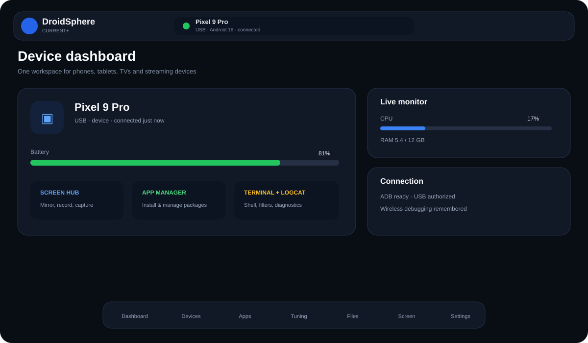
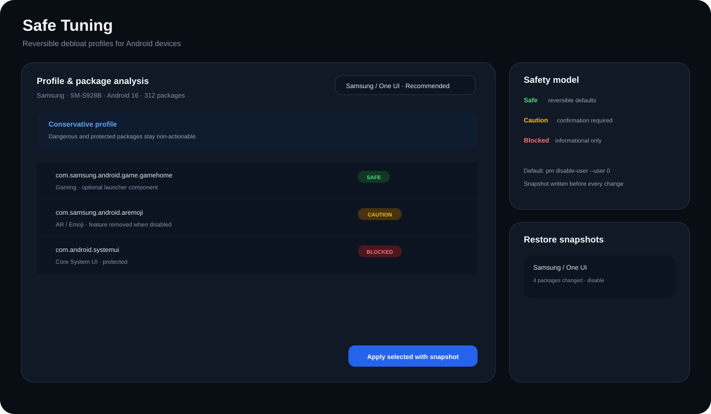
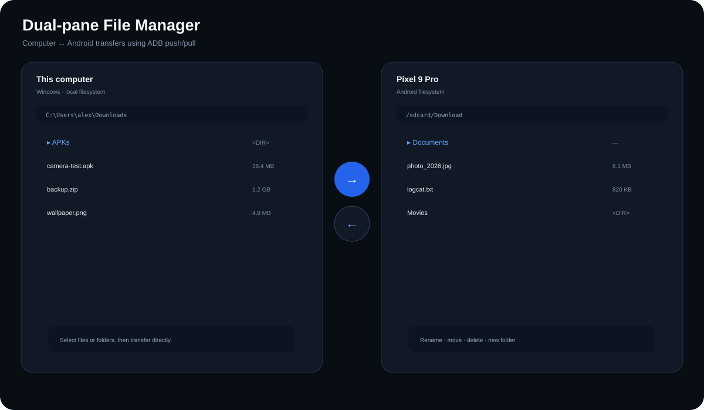
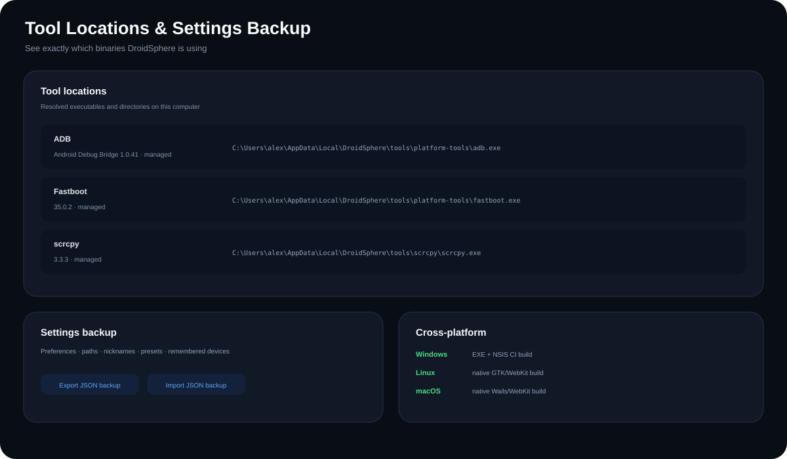

# DroidSphere

**A cross-platform desktop control center for Android devices.**

DroidSphere brings ADB, Fastboot and scrcpy workflows into one UI for **Android
phones, tablets, TVs and streaming devices**. It handles connection setup,
apps, files, Safe Tuning, screen tools, shell/Logcat, Fastboot workflows and
the local Android toolchain without requiring you to memorize commands.

> **Naming transition:** the GitHub repository still uses the historical
> `tvadb-hub` slug. The application and new build artifacts use the
> **DroidSphere** name.

## Screenshots

| Dashboard | Safe Tuning |
| --- | --- |
|  |  |
| **Dual-pane files** | **Tool locations & backup** |
|  |  |

> These are repository-rendered **UI previews** based on the current Current+
> layout and implemented workflows. They are not presented as runtime screen
> captures. Platform-specific release screenshots can replace them later.

## What DroidSphere can manage

DroidSphere works with standard Android debugging interfaces rather than a
vendor-specific companion app. Exact capabilities depend on the selected
device, Android version and authorization state.

### Connections and devices

- USB ADB device detection and multi-device-safe target selection.
- Android 11+ Wireless debugging pairing-code flow.
- mDNS discovery for secure pairing/connect services and legacy ADB.
- Remembered wireless devices with reconnect from the Current+ device selector.
- Device identity, Android/build information, battery, memory, storage and
  performance snapshots.
- Android TV remote controls when the selected target is detected as a TV.

### Apps and Safe Tuning

- Install APKs, update/replace existing apps and request downgrade installs.
- Install base + split APK sets with `adb install-multiple`.
- Launch, force-stop, enable, disable and uninstall packages.
- Pull installed APKs.
- Reversible Safe Tuning profiles for TVs, phones and tablets.
- Safe / caution / dangerous / blocked package classifications.
- Snapshot before tuning changes and exact restore of DroidSphere changes.
- Device/brand-aware profiles for Fire TV, Sharp/TCL TV, Samsung, Xiaomi,
  Redmi/POCO, Pixel, OnePlus and a conservative generic Android fallback.

### Files

- Dual-pane **computer ↔ Android** file manager.
- Browse the host filesystem on Windows, Linux and macOS.
- Browse Android storage with hidden-file support.
- Transfer multiple files or whole directories with ADB push/pull.
- Progress, cancellation and retry handling.
- Remote new-folder, rename, move and delete actions.
- Protected/scoped-storage error guidance.

### Screen, shell and logs

- scrcpy presets and session controls.
- Screenshot capture.
- Recording-oriented scrcpy controls and clipboard integration where supported.
- Interactive ADB shell.
- Live Logcat streaming, filters and export.
- TV-oriented shell shortcuts remain available for TV targets.

### Fastboot and recovery workflows

- Detect Fastboot devices.
- Reboot targets into supported modes.
- Partition and ROM-oriented flashing workflows.
- Sideload workflow.
- Explicit target selection and confirmation around destructive operations.

### Managed tools and settings

DroidSphere can locate or manage its own Android Platform Tools and scrcpy.
**Settings → Tool locations** shows the exact binary version, source and path
currently used for ADB, Fastboot, scrcpy and managed tool directories.

Settings can export/import a JSON backup containing preferences, binary paths,
device nicknames, scrcpy presets, remembered wireless devices and window state.
Older `tvadb-hub-settings` backups remain import-compatible after the rename.

## Quick start

### USB

1. Enable **Developer options** on the Android device.
2. Enable **USB debugging**.
3. Connect the device with a data-capable USB cable.
4. Accept Android's RSA authorization prompt.
5. Select the device in DroidSphere.

### Wireless debugging — Android 11+

1. Put the computer and Android device on the same network.
2. Open **Developer options → Wireless debugging**.
3. Choose **Pair device with pairing code**.
4. In DroidSphere, open the discovery/pairing flow and enter the six-digit code.
5. DroidSphere resolves the temporary pairing endpoint and reconnectable ADB
   endpoint automatically when mDNS information is available.

DroidSphere does not bypass Android authorization. The target device must
approve the normal USB or Wireless debugging trust flow.

## Safety model

DroidSphere intentionally keeps high-impact operations explicit:

- Safe Tuning defaults to reversible `pm disable-user --user 0`.
- A snapshot is created before tuning changes.
- Caution packages require explicit confirmation.
- Dangerous/blocked packages are not actionable in Safe Tuning.
- TV-specific profiles protect known launcher, DRM, input, remote and playback
  components.
- Fastboot/flash actions keep the active target visible and require deliberate
  user actions.

See [Safe Tuning source notes](docs/research/DEBLOAT_PROFILE_SOURCES.md) for
profile provenance and licensing.

## Platform status

| Platform | Compile CI | Current distribution status |
| --- | :---: | --- |
| Windows | ✅ | Portable EXE + NSIS installer workflow |
| Linux | ✅ | Native desktop build verified; package publishing next |
| macOS | ✅ | Native desktop build verified; signing/notarization next |

See [docs/PORTABILITY.md](docs/PORTABILITY.md) for host requirements and release
engineering details.

## Recommended next features

The next additions with the strongest practical value are:

1. **File preview + folder sync** — preview images/text, compare folder changes,
   define include/exclude patterns and choose conflict handling before sync.
2. **App backup & restore** — export base/split APK sets and restore them as a
   unit; add user-data backup only where Android actually permits it.
3. **Logcat 2.0** — app/PID filtering, crash and ANR highlighting, saved filter
   presets and pinned events.
4. **Connection Doctor** — one diagnostic flow for USB authorization, Wireless
   ADB/mDNS, network reachability, tool versions and common host-side problems.
5. **Permission/AppOps inspector** — begin read-only, then expose carefully
   scoped changes with before/after state.
6. **Quick Share integration** — longer-term, ordinary Android file exchange
   without requiring ADB for every transfer.

The first four fit the current architecture especially well. See
[docs/ROADMAP.md](docs/ROADMAP.md) for the maintained roadmap.

## Development

Current stack:

- Go 1.26
- Wails v3
- React / TypeScript
- Bun
- Vitest
- NSIS for the Windows installer

Install Wails:

```bash
go install github.com/wailsapp/wails/v3/cmd/wails3@latest
```

Install dependencies:

```bash
make deps
```

Run development mode:

```bash
make dev
```

Run normal checks:

```bash
make check
```

Build the current host platform:

```bash
make build
```

Explicit desktop targets:

```bash
make windows
make linux
make macos
```

Package the current platform:

```bash
make package
```

## Releases

Windows release CI produces canonical assets such as:

- `DroidSphere-<version>-windows-amd64.exe`
- `DroidSphere-<version>-windows-amd64-installer.exe`
- `SHA256SUMS.txt`

Optional Authenticode signing is supported through repository secrets. See
[docs/RELEASING.md](docs/RELEASING.md).

## Architecture notes

Wireless debugging is modeled around **device identity**, not a remembered TCP
port, because Android pairing/connect ports are dynamic.

Host-specific parts stay in Go and use `runtime.GOOS`, `filepath` and Wails
native dialogs so features remain portable across Windows, Linux and macOS.

See [docs/architecture/wireless.md](docs/architecture/wireless.md).

## Project history and attribution

DroidSphere is based on **ADBKit v2.0.0** by Drenzzz. The upstream MIT license
and attribution are preserved.

- Upstream: https://github.com/Drenzzz/ADBKit
- Imported baseline: commit `0908cded97caef9b7733f5de6f89f552e3d33109`
- Current repository: https://github.com/mrAibo/tvadb-hub

See [UPSTREAM.md](UPSTREAM.md), [THIRD_PARTY_NOTICES.md](THIRD_PARTY_NOTICES.md)
and [LICENSE](LICENSE).

DroidSphere is independent software and is not affiliated with Google or
Android device manufacturers.
